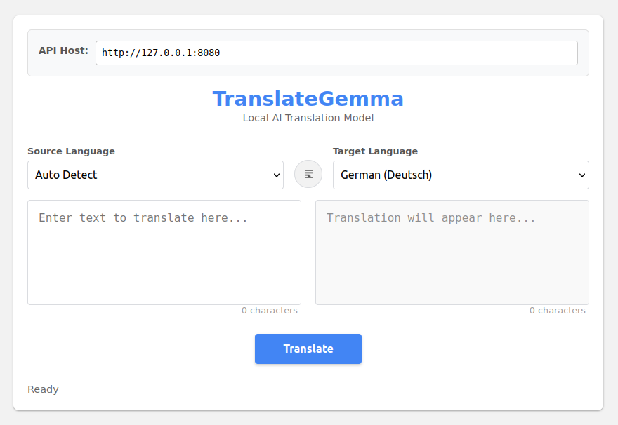

# 🌐 TranslateGemma MCP WebUI

For the WebUI just open ```translateGemmaWebUI.html``` in a browser and point it to your llama.cpp endpoint running TranslateGemma.



# 🌐 TranslateGemma MCP Server

A Model Context Protocol (MCP) server that provides high-quality text translation via the local **TranslateGemma** LLM API. Designed for low-latency, private, and secure on-device translation with full control over the underlying model.

## ✨ Features

- **Local Translation Inference**: Leverages TranslateGemma (or compatible OpenAI-like API) on your machine — no external data leaves your device.
- **Multi-Language Support**: Translate between any language pairs using standardized BCP-47 codes (`en`, `de-DE`, `fr-FR`, `ja-JP`, etc.).
- **Automatic Retries & Rate Limiting**: Built-in exponential backoff and 30 req/min rate limiting for stability.
- **Robust Error Handling**: Graceful failures with clear, actionable error messages.
- **Browser/Client Friendly**: CORS-enabled HTTP endpoint for direct integration.
- **LLM-Ready Output**: Clean, structured responses optimized for tool-use workflows.

---

## 🛠️ Requirements

- Python 3.9+
- `fastmcp`, `uvicorn`, `httpx`, and `starlette`
- A local TranslateGemma-compatible server (e.g., running via `ollama`, `vllm`, or custom server) exposing an OpenAI `/v1/chat/completions` endpoint.

```bash
pip install fastmcp uvicorn httpx starlette
```

## 🚀 Installation & Usage

### 1. Clone & Prepare
```bash
git clone https://github.com/woheller69/TranslateGemmaMCP.git
cd TranslateGemmaMCP
```

### 2. Start TranslateGemma Backend
Ensure your TranslateGemma API is accessible at `http://127.0.0.1:8080/v1/chat/completions` (or configure via `--api-url`).

```
llama-server -ngl 99 -m translategemma-27b-it.Q6_K.gguf -c 8000 --no-jinja
```

### 3. Launch the MCP Server
```bash
python3 server.py --host 0.0.0.0 --port 3000
```

Or override the API endpoint:
```bash
python3 server.py --api-url http://192.168.1.100:8000/v1/chat/completions
```

The server exposes an MCP-compatible HTTP endpoint at `http://localhost:3000/mcp`.

---

## 🧰 Available Tools

### `translate`

Translates text using TranslateGemma with intelligent language handling.

```python
async def translate(
    text: str,
    source_lang_code: str,
    target_lang_code: str,
    ctx: Context,
    max_retries: int = 2,
) -> str
```

#### Parameters
| Name | Type | Description |
|------|------|-------------|
| `text` | `str` | **Required.** The text to translate (up to ~2k chars recommended). |
| `source_lang_code` | `str` | **Required.** Source language code (e.g., `"en"`, `"auto"`, `"zh-Hans"`). |
| `target_lang_code` | `str` | **Required.** Target language code (e.g., `"de-DE"`, `"fr-FR"`, `"ja-JP"`). |
| `ctx` | `Context` | MCP context (auto-injected). Used for logging. |
| `max_retries` | `int` | Retry attempts on transient failures (default: `2`). |

#### Returns
- ✅ Translated text (clean, trimmed)
- ❌ Error message (prefixed with `❌` / `⚠️`) on failure

---

## ⚙️ Configuration

| CLI Flag | Environment | Default | Description |
|----------|-------------|---------|-------------|
| `--host` | `HOST` | `127.0.0.1` | Server host (use `0.0.0.0` for external access) |
| `--port` | `PORT` | `3000` | Server port |
| `--api-url` | `API_URL` | `http://127.0.0.1:8080/v1/chat/completions` | TranslateGemma API endpoint |

---

## 🔒 Security & Privacy

- All translation is performed **locally** on your machine.
- No telemetry, external tracking, or data collection.
- CORS configured permissively (`*`) for local dev — **restrict origins in production**.

---

## 📄 License

MIT License — see [`LICENSE`](LICENSE) for details.

---
